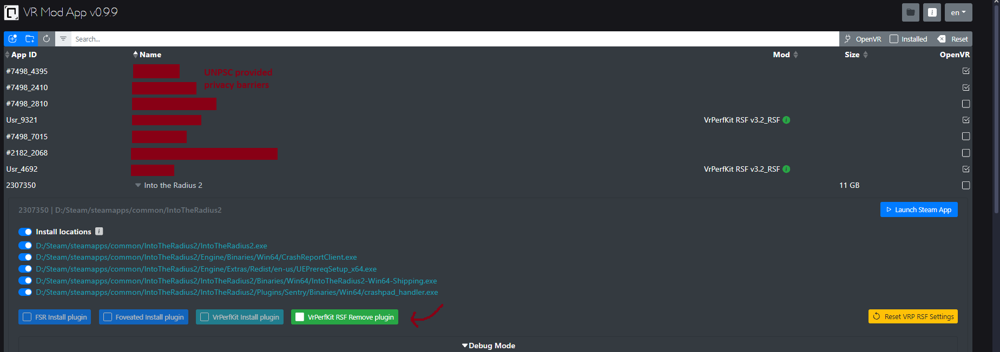
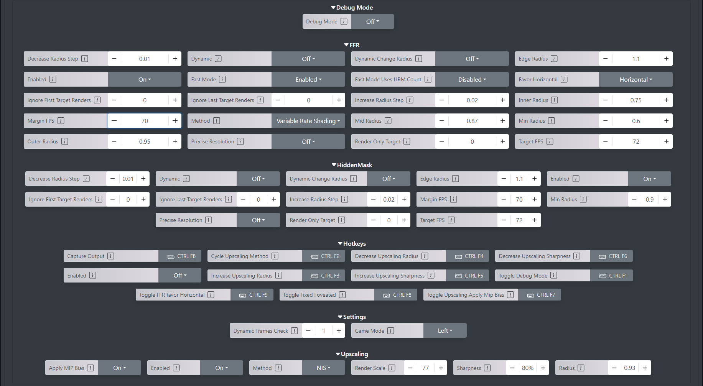

# SNB's Ultimate Performance

> This guide was created by SNB, modified for readability on GitHub by Merith-TK.

> This guide does not increase visual quality.

## SNB's Specs

- **CPU:** AMD Ryzen 5 3600
- **GPU:** GTX 1650S 8GB
- **RAM:** 16GB DDR4
- **FPS:** 72 (capped)

> **Important:**  
> BACK UP ANY FILES IF YOU WANT TO CONSIDER ROLLBACK IN CASE OF NOT BEING SATISFIED!  
> Or don't, because we ball.

---

## File Locations

1. **AppData Local Folder**  
   In Windows Explorer, type `%LOCALAPPDATA%/IntoTheRadius2/Saved` in the address bar and hit Enter.  
   Paste the contents of `LOCALAPPDATA/IntoTheRadius2/Saved` here.

2. **Documents My Games Folder**  
   In Windows Explorer, type `%USERPROFILE%/Documents/` and hit Enter.  
   Look for the `My Games` folder and place the `IntoTheRadius2` folder you find here into the `My Games` folder.  
   The files should be placed in:  
   `Documents/My Games/IntoTheRadius2`

3. **ITR2 Content Folder**  
   Navigate through your Steam files to the game directory and place the `IniSettings` folder into:  
   `IntoTheRadius2\IntoTheRadius2\Content\ITR2\`  

---

This should now accurately reflect the file paths mentioned in your instructions. Let me know if you need further adjustments!

---

## OpenVR RSF Performance Boost

1. **Download the App**  
   Download the desktop app from GitHub:  
   [OpenVR FSR Performance Boost - GitHub](https://github.com/tappi287/openvr_fsr_app/releases/tag/0.9.9)

2. **Open the App**  
   Launch the app (it may open as a tab in your browser).  
   Your Steam library should be automatically scanned, and `IntoTheRadius2` will appear as an option.

---

### RSF Step 1

- **Image Placeholder:**   
  Open the drop-down menu for `IntoTheRadius2` and select the "VrPerfKit RSF Install plugin" option.

---

### RSF Step 2

- **Image Placeholder:** 
  Carefully copy all the settings in the image to your settings—don’t miss a thing!  
  You can adjust the FPS target to your max FPS, but the most important part is the **Hidden Mask** options.

---

### Additional Tips

- **Upscaling Preferences:**  
  If you want to squeeze extra FPS through upscaling, keep it between **70% and 100%**.  
  The same applies to sharpening—don't go below 70%, and not higher than 100%.
